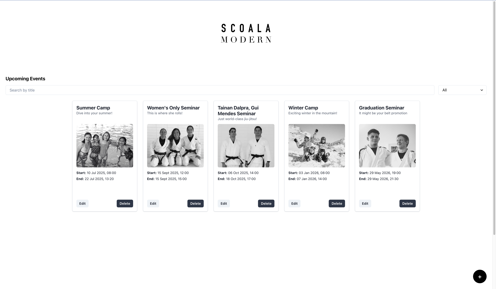

# 🗓️ Event Dashboard (React + Chakra UI)

A clean and modern event management dashboard built with React, Chakra UI, and JSON Server.  
Create, edit, search, filter, and delete events with category tags, image upload (with cropping), and mobile responsiveness.

---

## ✨ Features

-  Considerate design
-  Add / Edit / Delete events
-  Image upload with zoom function & 3:2 cropping (using `react-easy-crop`)
-  Search and filter by event title or category
-  Fully responsive (mobile, tablet, desktop)
-  Modal-based event creation/editing
-  Event pages page back button 
-  JSON Server-powered local API backend

---

## 🚀 Tech Stack

- ⚛ React (with Router)
-  Chakra UI
-  JSON Server
-  react-easy-crop
-  Multer (optional for image upload backend)

---

## 🖥️ Screenshots

| Event List | Event Detail | Event Form (Edit) |
|------------|--------------|-------------------|
|  | 

---

## 🔧 Getting Started


### 1. Clone the repo

```bash
git clone https://github.com/KunstGelder/event-dashboard-react.git
cd event-dashboard-react
```
### 2. Install dependencies

```bash
npm install
```
### 3. Start the backend (JSON Server)

```bash
npm run server
```
### 4. Start the frontend (React + Vite)

```bash
npm run dev
```
